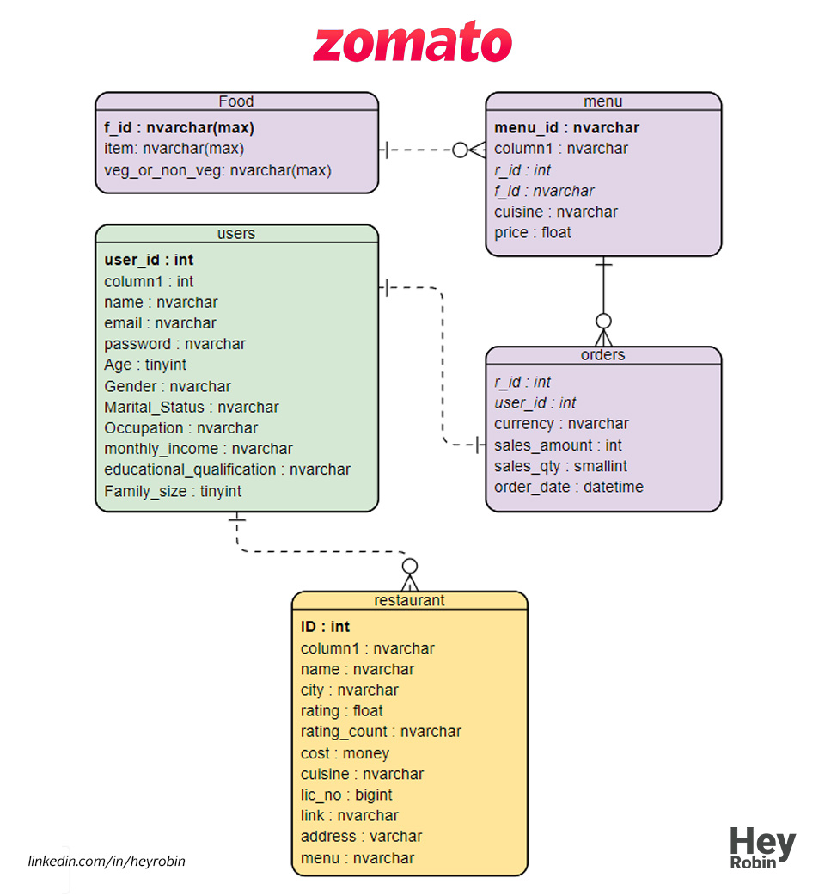

# Zomato : restaurant aggregator and food delivery (Analysis)
**Author**: Robin Singh  
**Email**: HeyRobinSingh@gmail.com  
**Website**: https://heyrobin.github.io/  
**LinkedIn**: https://www.linkedin.com/in/heyrobin/   

:exclamation: If you find this repository helpful, please consider giving it a :star:. Thanks! :exclamation:

## Introduction
An SQL analysis of Zomato sales data between 2017 and 2020.
* [Data Analysis Question & Answers](./analysis.md)

## Datasets used
- <strong>food.csv</strong>: details about food.
- <strong>menu.csv</strong>: all menu data.
- <strong>orders.csv</strong>: order details.
- <strong>restaurant.csv</strong>: restaurants data.
- <strong>user.csv</strong>: users data.

## Entity Relationship Diagram

:exclamation: If you find this repository helpful, please consider giving it a :star:. Thanks! :exclamation:
